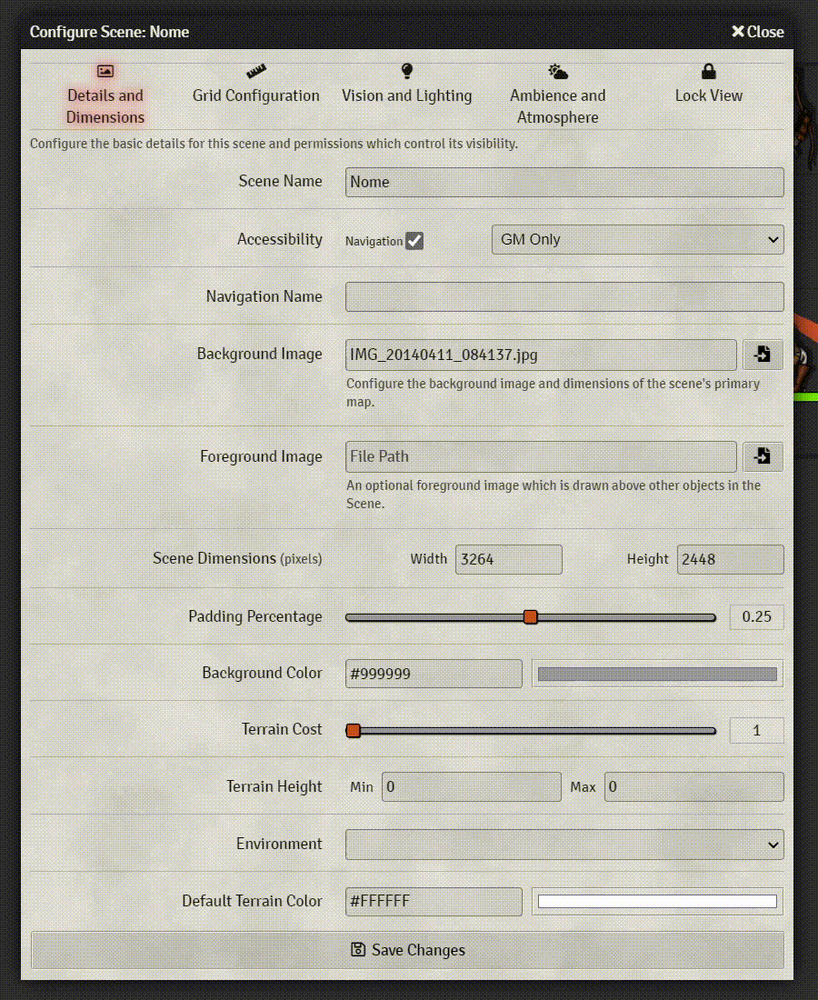
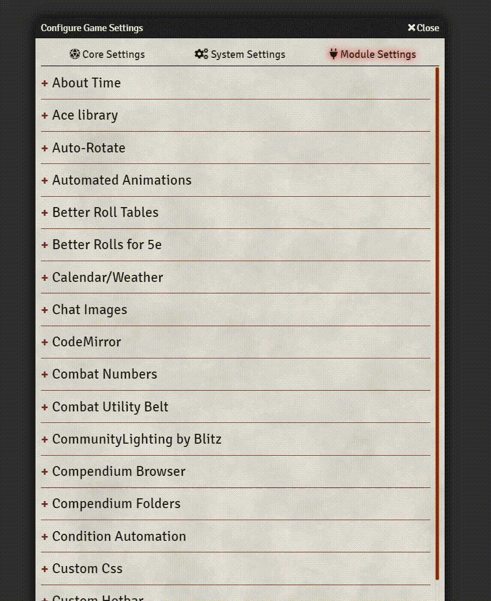
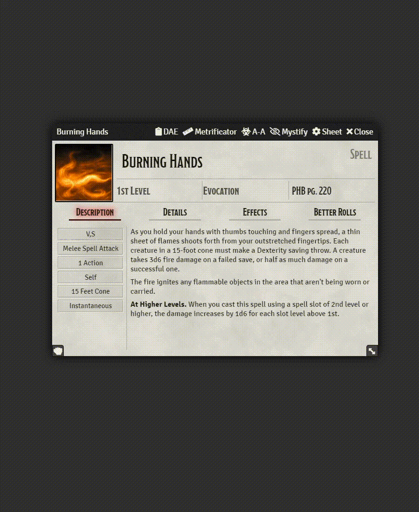

# Twilight Forms
A simple module to separate long forms into sections, and make labels align to the right. If you don't like them aligned to the right, you can change make them align to the top, or the left.

# Screenshots

